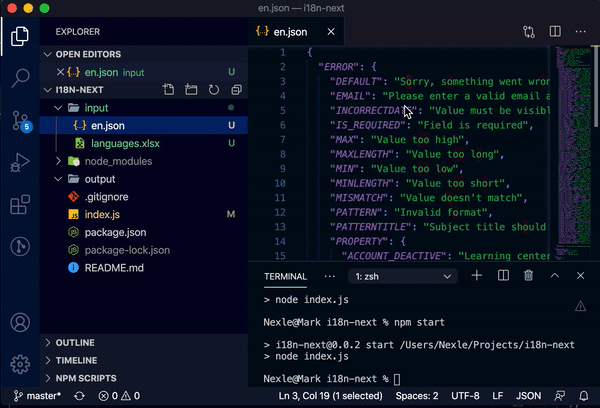

# Easier way to make your next i18n language

**Context**: 
- You are maintaining an old project. Client want to add new language by give you an Excel file named **languages.xlsx**. Your existed project have thousands line of text.
- You had an **en.json** (English translate) file.
- Your client give you a new excel file that contain English and next languages.
- You have to create new **next.json** file (next-language could be cn(Chinese), ge(Germany), fr(French), ...).

**Traditional Way**: 
- You create a new next-language.json file .
- You add line by line of new language.

**Better way**
- Install **i18n-next**
- Input your 2 files into **input** folder: excel file (containing languages) and en.json file
- launch 'npm start'
- A new language file will be created in **output** folder

